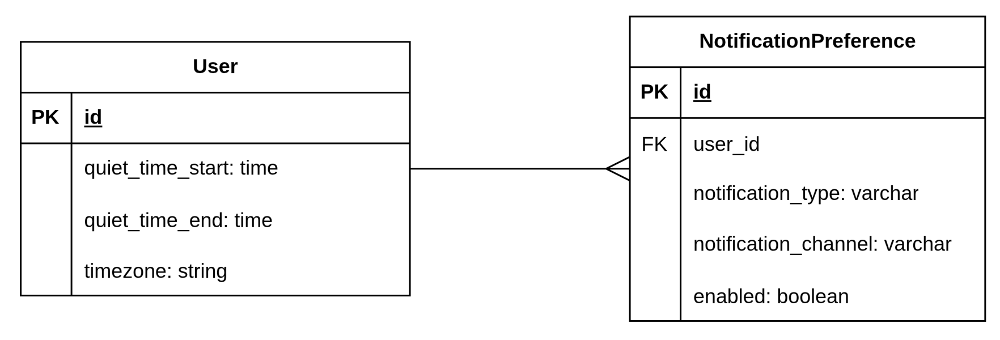
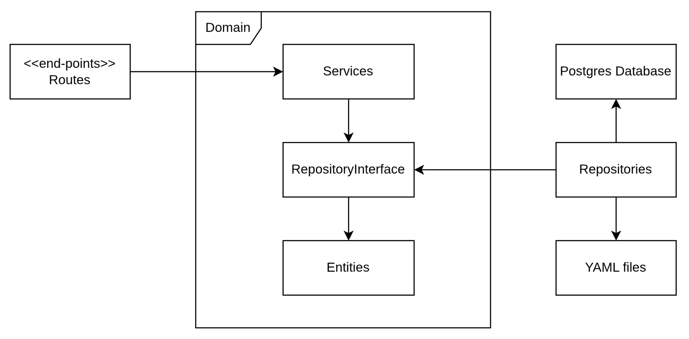
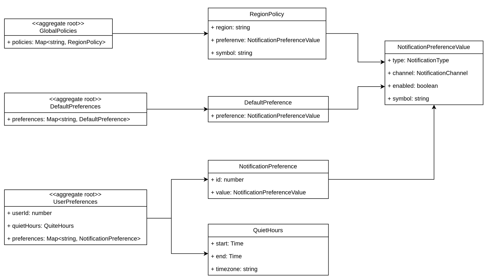
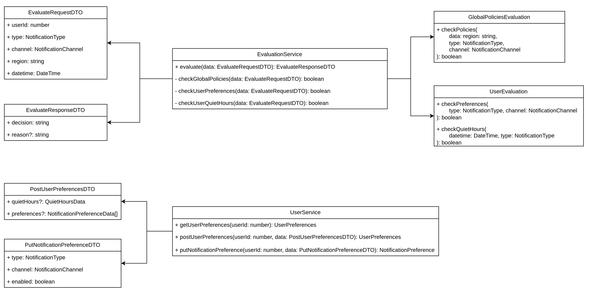

# Тестовое задание: Notification Preferences Service

Стек: Node.js, TypeScript, Express.js, Vitest, TypeORM, PostgreSQL

Чтобы развернуть приложение через терминал выполните:

1. Перейдите в корень проекта
2. Создайте файл `.env`, скопируйте в него содержимое `.env.example`
3. Отредактируйте настройки подключения к СУБД в `.env` при необходимости
4. Создайте базу данных `npm run db:init`
5. Создайте нужные таблицы в БД `npm run db:migration:run`
6. Запустите приложение командой `npm start`

```shell
cd <notification-preferences-service-path>
cp .env.example .env
npm run db:init
npm run db:migration:run
npm start
```

Изменить глобальные политики можно в файле `src/configs/global_policies.yaml`.

Изменить настройки уведомлений по умолчанию, которые используются для регистрации новых пользователей, можно в файле `src/configs/defaults_preferences.yaml`.

Запуск тестов доступен командой `npm test`.

## Доступные end-points

`POST /users/{id}/preferences` - добавление или изменение настроек пользователя  
`GET /users/{id}/preferences` - получение всех настроек пользователя  
`PUT /users/{id}/preferences/notification` - изменение настройки уведомления одного сочетания типа/канала  
`POST /evaluate` - проверка доступности рассылки уведомлений

## Информационная модель БД



## Слои приложения



## Диаграмма основных сущностей



## Диаграмма сервисных компонентов


